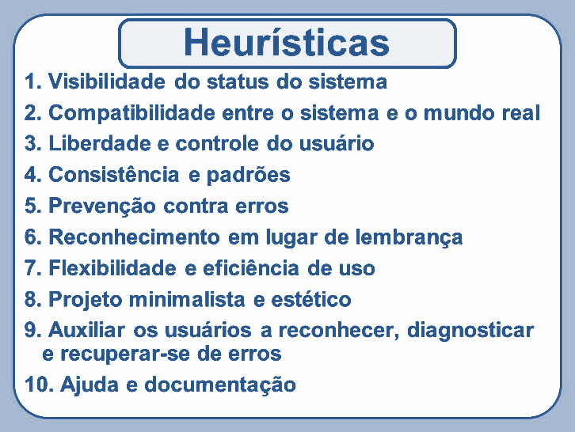
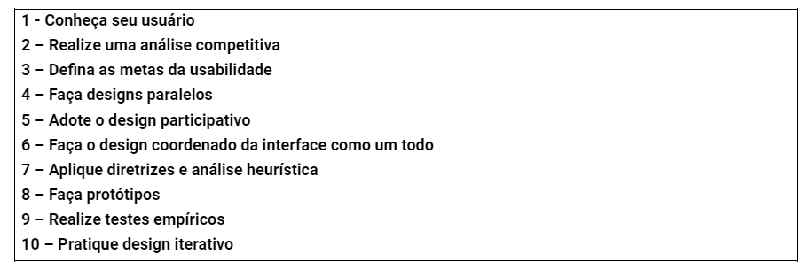
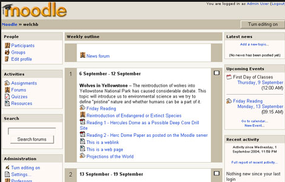
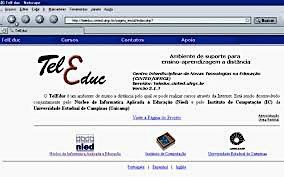
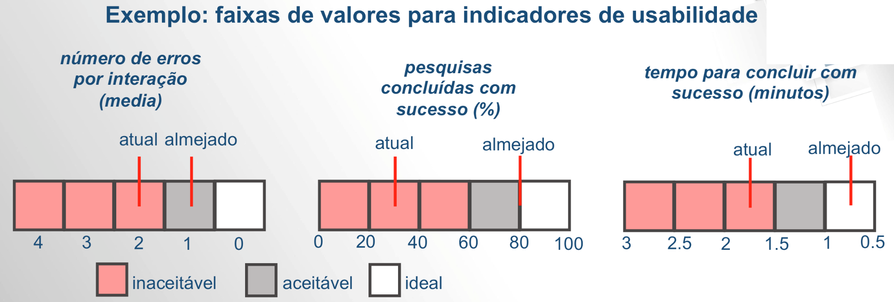

# Avaliação de Interfaces e Engenharia de Usabilidade

## Por que avaliar interfaces?

Avaliações de uso da interface do sistema interativo são necessárias para responder às dúvidas que surgem durante o processo de desenvolvimento da interface.

Os designers necessitam de respostas obtidas a partir das avaliações para verificar se suas ideias são realmente as que os usuários necessitam ou desejam.

Dessa forma, a avaliação de interfaces direciona e se mescla ao próprio design.

## Outros motivos para avaliar interfaces

Pense que muitas questões poderiam ser objetivo de uma avaliação.

Por exemplo, o setor de marketing poderia estar interessado em saber como o produto de sua empresa se compara com produtos de outros competidores do mercado.

Produtos em construção também podem ser avaliados para verificar se estão de acordo com padrões específicos, como as normas de qualidade ISO, por exemplo.

## Quando avaliar interfaces?

Pode haver avaliações que ocorrem depois do produto desenvolvido que se preocupam com o produto final: irá avaliar a performance do design considerando produtos competitivos, adequação a uma determinada família de produtos, validação do usuário, etc...

## O que avaliar em uma interface?

Podemos dizer que a avaliação tem três grandes objetivos:

- Avaliar as funcionalidades do sistema
- Avaliar o efeito da interface junto ao usuário, e
- Identificar problemas específicos do sistema interativo

A funcionalidade do sistema deve permitir ao usuário efetuar a tarefa pretendida de modo mais fácil e eficiente. Isso inclui não somente ter a funcionalidade adequada, mas também torná-la usável, na forma de ações que o usuário precisa efetuar para executar a tarefa. Avaliação envolve também medir a performance do usuário junto ao sistema, ou seja, avaliar a eficiência do sistema na execução da tarefa pelo usuário.

É preciso medir também o impacto do design junto ao usuário, ou seja, avaliar sua usabilidade. Isso inclui considerar aspectos tais como: se é fácil aprender a usar o sistema; a atitude do usuário com relação ao sistema; identificar áreas do design que sobrecarregam o usuário de alguma forma (por exemplo, na forma de uma série de informações que necessitam serem lembradas, etc).

O terceiro objetivo da avaliação é identificar problemas específicos com o design, ou seja, identificar aspectos do design que causam resultados inesperados ou confusão entre os usuários.

Isso está relacionado tanto com a funcionalidade quanto com a usabilidade do design.

## Métodos de avaliação de usabilidade: Heurística

Existem diferentes estratégias de avaliação de usabilidade de sites, entre elas:

- Teste com usuários selecionados em locais controlados.
- Investigação em campo acompanhando o uso real do sistema por usuários.
- Análise baseada em modelos que não necessitam da participação de usuários reais.

## Método de Avaliação de Interfaces: Inspeção

- Especialistas inspecionam a usabilidade de uma aplicação.
- Não há participação dos usuários.
- Podem ser executados em qualquer fase do desenvolvimento.
- Não permitem analisar o real uso da aplicação, o método baseia-se na habilidade dos avaliadores em detectar problemas.

Entre os métodos de avaliação de interfaces que ocorrem por inspeção, o mais famoso e importante deles é a Heurística de Nielsen: é um método relativamente barato, prático e rápido.

Vale lembrar que métodos de inspeção têm por base um conjunto de diretrizes de usabilidade que descrevem características desejáveis de interação e interface, chamadas por Heurísticas de Nielsen:

1) Visibilidade de status do sistema: O sistema deve manter os usuários informados sobre o que está acontecendo, fornecendo um feedback adequado dentro de um tempo razoável.

2) Compatibilidade entre o sistema com o mundo real: Não usar palavras de sistema que não fazem sentido para o usuário. Toda comunicação do sistema deve ser contextualizada ao usuário, ser coerente com o `modelo mental do usuário`.

3) Liberdade e Controle do usuário: usuários frequentemente escolhem funções por engano.  O sistema deve prover saídas de emergência, deve permitir fazer e desfazer ações para socorrer o usuário.

4) Consistência e padrões: Fale a mesma língua o tempo todo, trate de coisas similares da mesma maneira, facilitando a interpretação do usuário.

5) Prevenção de erros: expressar de forma clara onde está o erro e claramente auxiliar o usuário, o bom design evita que o usuário cometa erros.

6) Reconhecimento ao invés da lembrança: evite acionar a memória do usuário o tempo todo, permita que o sistema dialogue com o usuário por meio de ajuda contextual e informações bem colocadas.

7) Flexibilidade e eficiência de uso: prover formas de fazer com que usuários mais experientes possam realizar tarefas mais rapidamente e que o sistema seja fácil de usar também por usuários menos experientes.

8) Estética e design minimalista: o sistema não deve conter informação irrelevante ou que é raramente necessária.

9) Ajude os usuários a reconhecer, diagnosticar e sanar erros: as mensagens de erro do sistema devem possuir uma redação simples e clara de modo que, ao invés de intimidar o usuário, indiquem uma solução.

10) Ajuda e documentação: embora seja melhor um sistema que não precise de documentação, é necessário prover ajuda e documentação. Essas informações devem ser fáceis de encontrar, focalizadas na tarefa do usuário e não muito detalhadas, em princípio.

Resumindo o método de teste de interface por meio de inspeção, segundo as Heurísticas de Nielsen:

## Método de avaliação: Teste com o usuário

Sobre o método que visa acompanhar o usuário em uma situação real de uso, podemos considerar:

- Grupos de usuários realizam tarefas enquanto são observados por especialistas.
- A interação dos usuários com a aplicação revela problemas de interface.
- É um método bastante caro (selecionar usuários, contratar especialistas, analisar dados, etc).
- Não é possível simular todas as variáveis relacionadas ao contexto de uso.

Usuários podem agir diferente por saberem que estão sendo observados por um avaliador de interfaces.

Em resumo, cada projeto precisa ser estudado para se chegar à forma mais conveniente de testar uma interface.

A engenharia de usabilidade é um conjunto de atividades propostas pelo pesquisador  Jakob Nielsen que devem ocorrer durante todo o ciclo de vida de desenvolvimento do sistema interativo.

Algumas atividades ocorrem nos estágios iniciais do desenvolvimento do sistema, antes mesmo que a interface com o usuário tenha sido projetada.

Embora muito genéricas, funcionam com princípios seguros para iniciar o desenvolvimento de uma interface.

## Engenharia de Usabilidade

Jakob Nielsen, além das famosas Heurísticas, propôs o que ele mesmo chamou de Engenharia de Usabilidade. Um conjunto de diretrizes muito úteis para serem aplicadas em todo o ciclo de vida do sistema. Passa por seguir os seguintes passos.

Vamos a alguma descrição de cada uma das atividades previstas por Jakob Nielsen.

1) Conheça seu usuário

O primeiro passo consiste em estudar os usuários e os usos pretendidos pela aplicação. Sabe-se que a variabilidade de usuários é o principal fator que impacta a usabilidade.

Envolve conhecer as características não só individuais, mas também o ambiente físico e social de trabalho.

Nielsen alerta que a própria aplicação modifica a atitude dos usuários e à medida que isso ocorre, eles usarão o sistema de novas formas.

2) Realize uma análise competitiva

Consiste em examinar outras aplicações com funcionalidades semelhantes ou complementares. Como esses produtos já estão prontos, podem ser testados com mais facilidade e realismo do que protótipos.

Com essa análise obtém-se aspectos positivos e negativos da usabilidade e surgem novas ideias.

As duas interfaces ao lado são de sistemas para ensino à distância. A análise competitiva é uma ferramenta importante para o desenvolvimento de uma nova interface, neste caso, de cursos EAD.

3) Defina as metas de usabilidade

Passa por definir os fatores de qualidade de uso que devem ser priorizados no projeto, como serão avaliados ao longo do processo, quais faixas de valores são aceitáveis ou ideais para cada indicador de interesse.

Neste exemplo são apresentadas metas de usabilidade em termos de indicadores de erros, pesquisas com sucesso e tempo para concluir uma tarefa. Note as faixas de tolerância. Adaptado de Preece (2012)

4) Faça designs paralelos

Elaborar diferentes alternativas de design, por designer trabalhando de formas diferentes.

Duas interfaces diferentes podem resultar de esforços diferentes para um mesmo projeto.

5) Adote o design participativo

Nielsen sugere que a equipe de designers tenha acesso permanente a um conjunto de população-alvo de usuários. Isso favorece um feedback interessante das questões e soluções propostas.

6) Faça o design coordenado da interface como um todo

A ideia é desenvolver a interface como um todo, isso inclui não apenas os elementos da interface propriamente dita, mas também toda a documentação, o sistema de ajuda e tutoriais produzidos sobre o sistema. Todos esses itens deveriam ser desenvolvidos ao mesmo tempo.

7) Aplique diretrizes e análise heurística

À medida que a interface vai sendo desenvolvida, deve ser aplicada sobre ela um conjunto de avaliações.

O tema heurísticas de Nielsen foi tratado acima, e devem ser utilizados como, por exemplo, visibilidade do sistema: usuários devem saber o que está acontecendo no sistema (envio de arquivo para impressora, por exemplo).

8) Faça protótipos

Protótipos são versões do sistema ainda não terminadas e nem completamente testadas. O futuro usuário ao ter acesso a um protótipo pode sugerir mudanças e esclarecer melhor aos desenvolvedores como o sistema pode ser aperfeiçoado.

9) Realize testes empíricos

Nielsen sugere que testes de usabilidade sejam aplicados em todo o ciclo de vida do produto. 

10) Pratique design iterativo

Com base nos problemas de usabilidade apontados e nas oportunidades apresentadas, os desenvolvedores produzem novas versões da interface e repassam todas as atividades do processo.

