# Avaliação de Interfaces e Técnica Eyetracking

## Lembrando... Por que avaliar interfaces?

Avaliações de uso da interface do sistema interativo são necessárias para responder às dúvidas que surgem durante o processo de desenvolvimento da interface.

Os designers necessitam de respostas obtidas a partir das avaliações para verificar se suas ideias são realmente as que os usuários necessitam ou desejam.

Dessa forma, a avaliação de interfaces direciona e se mescla ao próprio design.

## Método de avaliação: Teste com o usuário

Sobre o método que visa acompanhar o usuário em uma situação real de uso, podemos considerar:

- Grupos de usuários realizam tarefas enquanto são observados por especialistas.
- A interação dos usuários com a aplicação revela problemas de interface.
- É um método bastante caro (selecionar usuários, contratar especialistas, analisar dados, etc)
- Não é possível simular todas as variáveis relacionadas ao contexto de uso.

Usuários podem agir diferente por saberem que estão sendo observados por um avaliador de interfaces.

Em resumo, cada projeto precisa ser estudado para se chegar à forma mais conveniente de testar uma interface.

## Técnica de teste de interfaces: Eyetracking

Sempre que estamos testando uma interface, buscamos responder:

- Quem são os usuários?
- O que os usuários estão tentando fazer?

Para responder a essas questões, existem técnicas diretas que são aplicadas para observar a relação de usuários com interfaces.

Chamamos de eyetracking o caminho que o olhar de uma pessoa segue ao percorrer a tela de um computador.

Eyetracking pode ser construído no monitor de computador e utiliza o suporte de um software para armazenar o caminho por onde passa o olhar do usuário, enquanto ele olha e navega em um site.

A tecnologia é uma combinação de câmeras apontadas para os olhos dos usuários, usa-se também luz infravermelha.

Uma das ideas do eyetracking e de estudos de interface, em geral, é que as empresas devem encontrar um balanço entre o que elas querem que os usuários façam no site e o que os usuários realmente querem fazer.

São exemplos de experiências neste sentido:

- Reação dos usuários para comprar um produto: interessaria a uma e-commerce de varejo, por exemplo.
- Reação para realizar uma tarefa específica: selecionar um curso em uma faculdade.

A técnica de eyetracking só mede o que as pessoas veem, não se elas gostam ou não do que veem.

Às vezes um elemento que não é visto pode ser algo positivo, por exemplo, elementos de navegação que se repetem em todas as telas.

Por outro lado, pessoas podem olhar demais para um parágrafo para tentarem entender o que está escrito, o que seria algo negativo.

Assim, pode ser bom ou ruim um elemento ser ignorado ou olhado em excesso na tela do computado.

Isso significa que a técnica de eyetracking deve considerar as interações dos usuários e o impacto da usabilidade de seus comportamentos.

Duas formas de registro de eyetracking são utilizadas: heat maps e gaze plots.

### Heat Maps

As áreas vermelhas são aquelas em que os usuários olham mais, as amarelas, um pouco menos e as azuis as que eles olham menos. A metáfora de cores significa, cores quentes, zonas quentes; cores frias, zonas frias. A área cinza não foi olhada. Mapas de calor significam tanto o número de olhadas quanto o tempo de duração delas. Na prática essa diferença não é muito significativa quando se tem muitos usuários participando da experiência.

Exemplo de heat maps

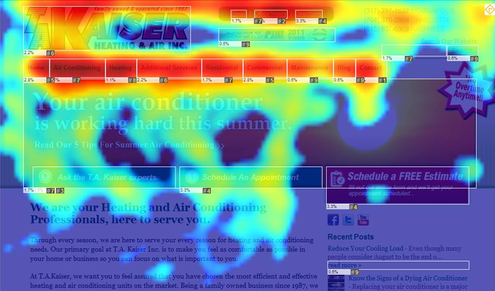

### Gaze Plots

Apresentam a visita de um só usuário na página. Quanto maior o balão, maior a duração da mirada, as linhas representam o movimento de um ponto a outro da tela.

O número representa a sequência da mirada.

É bom lembrar que as pessoas não enxergam o que está no caminho quando se movimentam de um ponto a outro da tela.

Exemplo de gaze plots.

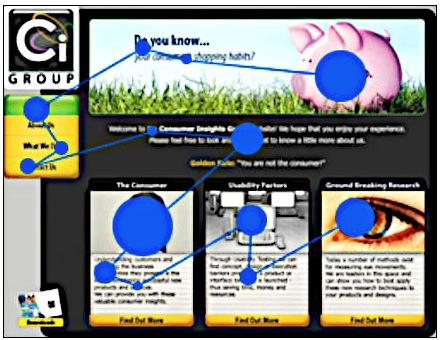

Na figura abaixo, temos um exemplo de como os usuários olham toda a interface encorajados pelo design simples da interface.

Exemplo de heat maps.

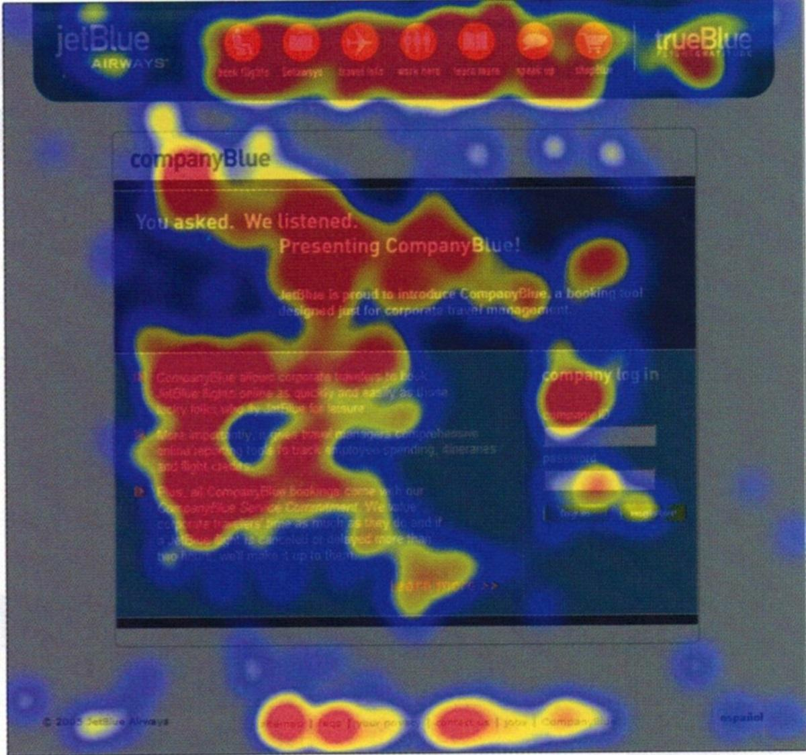

Outro exemplo muito interessante demonstra como os usuários não olham para tabelas em uma interface. Esta é uma página dedicada a jogadores de baseball norte-americanos.

**A pergunta é: para onde os usuários olham nesta interface?**

Website a ser testado com eyetracking, dedicado a jogadores de golfe americanos.

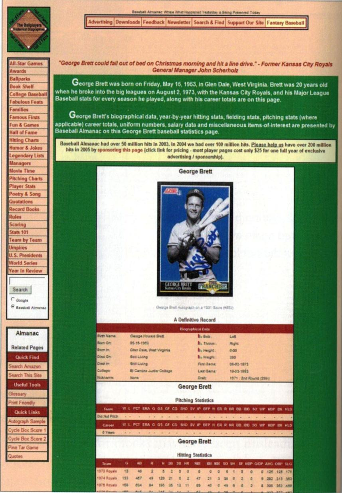

Observe o heat map dessa interface na figura a seguir:

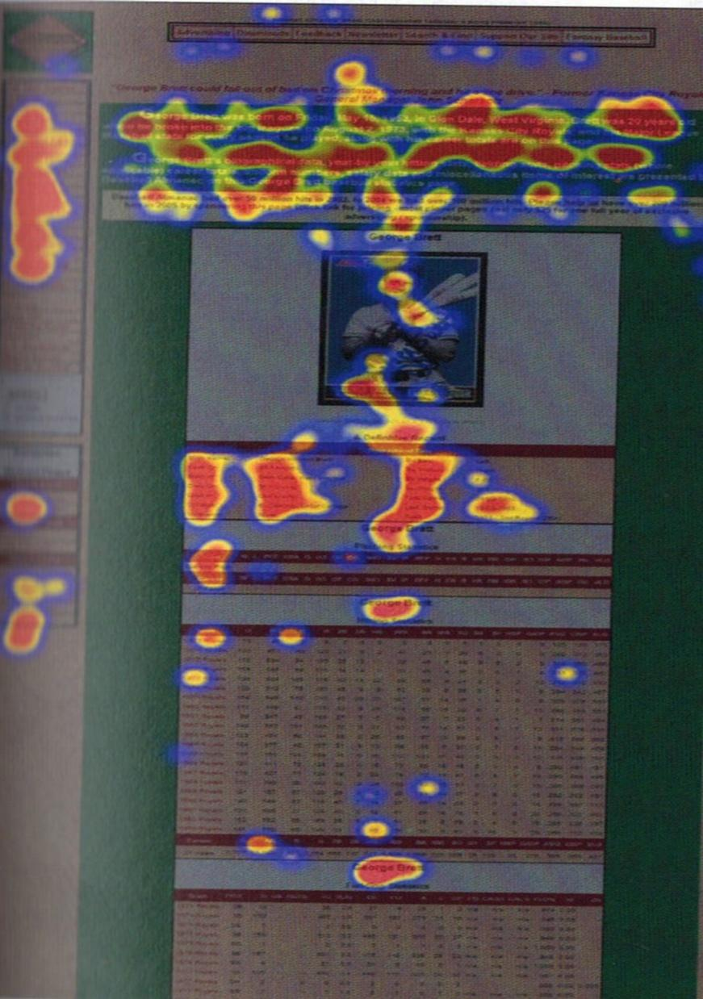

Nesta interface, a análise do heat map demonstra que os usuários não leem as tabelas. Nielsen (2010)

A mesma interface quando submetida ao eyetracking. Neste exemplo, as pessoas estão muito mais interessadas no texto do que nas informações na tabela.

Curiosamente este site revela outros problemas como o fato de chamar a atenção para vários elementos que simplesmente não têm qualquer relação com o jogador.

Falta de prioridade, abreviações indefinidas, texto indefinido e links para informações não relevantes tornam este site difícil para as pessoas encontrarem o que elas precisam.

Glaze plots mostram a preferência dos usuários em ler o texto, mas só a primeira parte dele que deveria ser a mais importante.

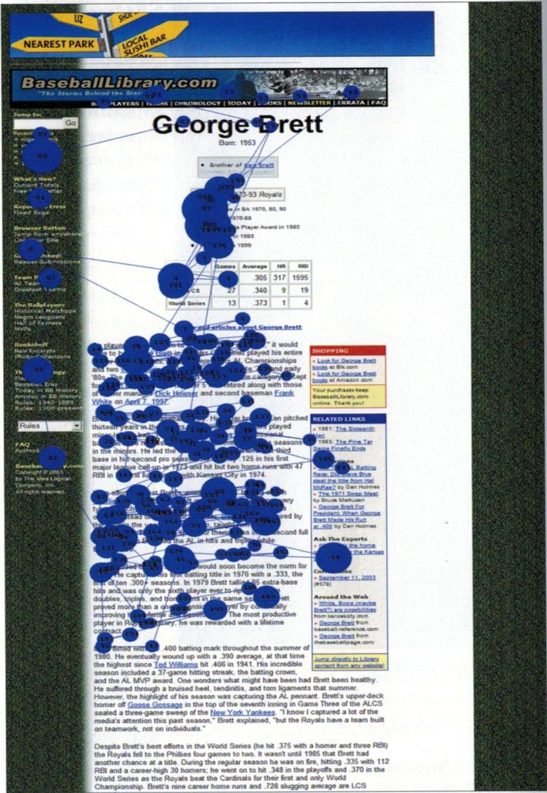

Outros exemplos (acima a figura original, abaixo dela, a figura que resulta da avaliação por meio de eyetracking)

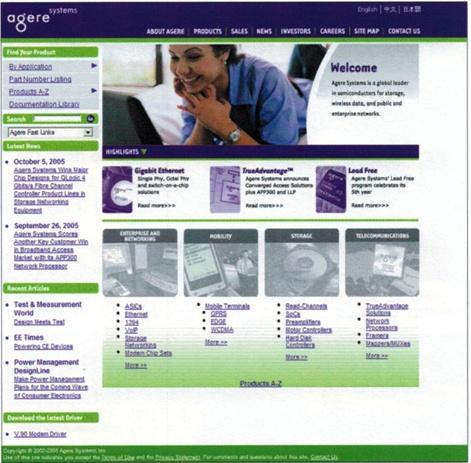

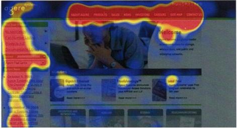

Qual a conclusão neste caso?

Observe mais este e outros exemplos que apresentam a interface e a técnica do eyetracking aplicada a elas.

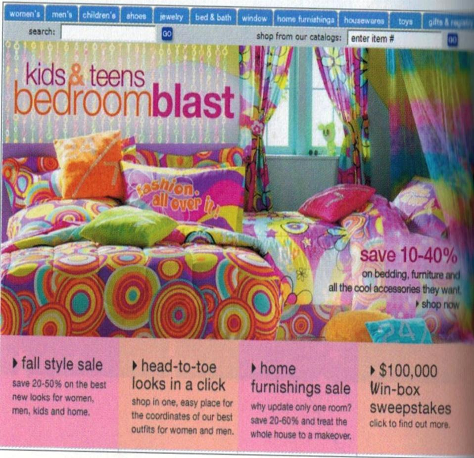

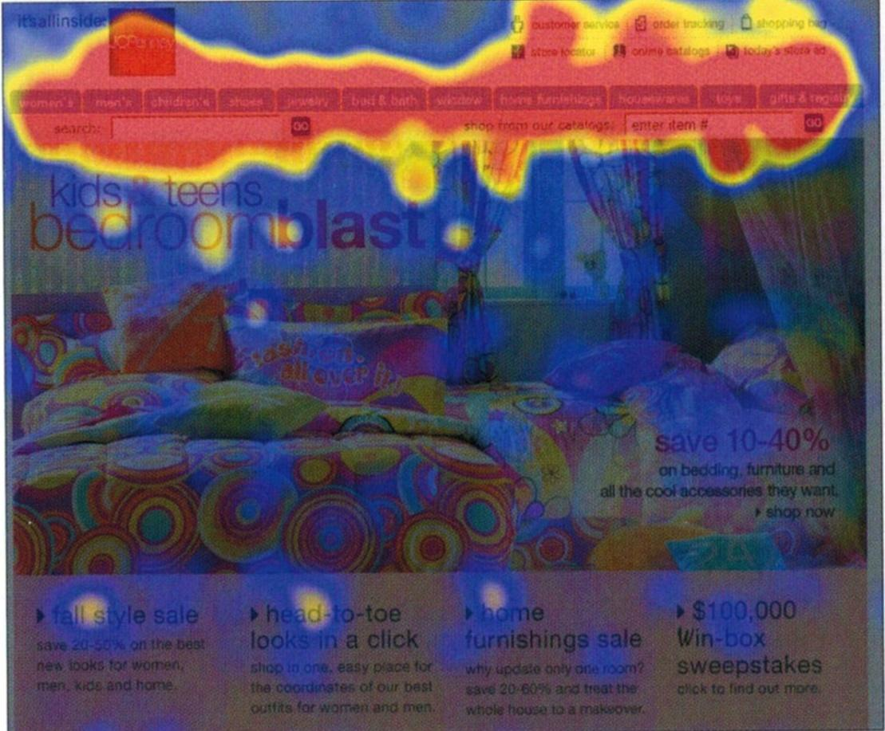

Neste exemplo, fica claro que o espaço da tela não está sendo bem aproveitado, não atrai os olhos ou provê informação útil. Imagens tomam 33% da tela mas não geram calor: um sério desperdício de espaço e erro de design.

A informação mais importante está na parte de baixo à direita, a promoção no site não é efetiva. Pessoas olham a imagem "barulhenta", não os itens no texto em si.

Vamos a outro exemplo. Desta vez a interface foi submetida ao eyetracking tanto com heat maps quanto com glaze plots.

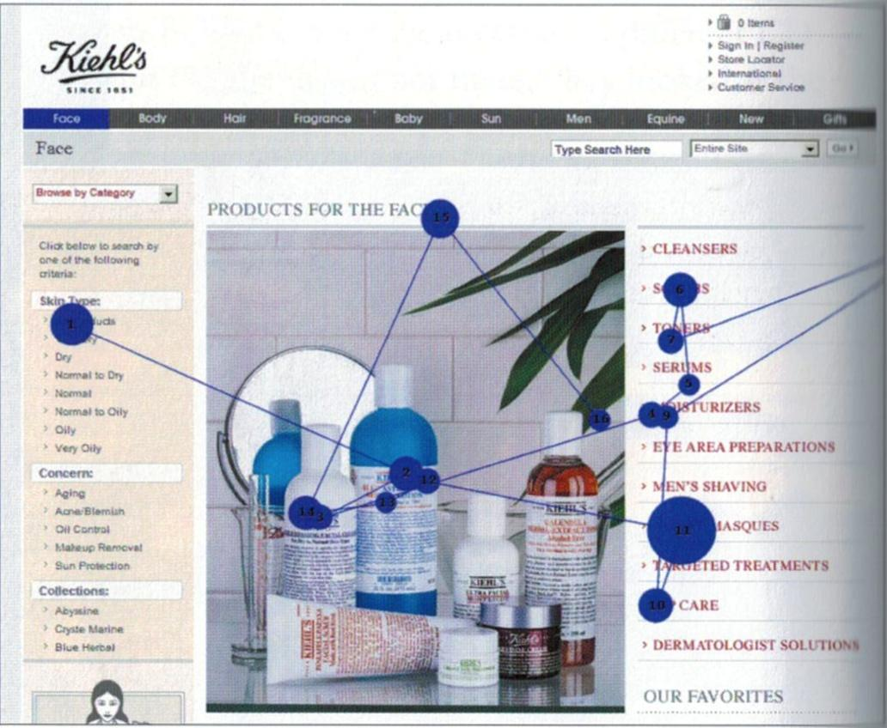

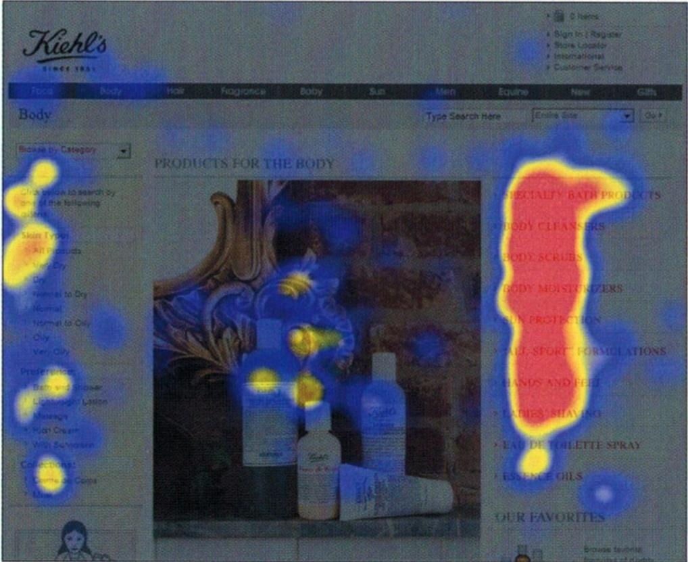

Nesta tela, o usuário mira o menu esquerdo e logo salta para o menu direito. Como o layout da página distribui os menus à esquerda e à direita, o menu na parte superior é ignorado! Uma lição importante do design é tirada deste exemplo: as pessoas sempre devem ter a opção de parar uma animação.

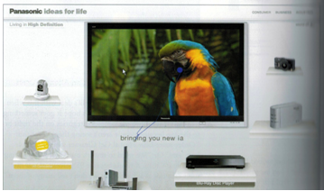

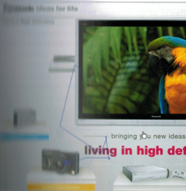

Para entender mais ainda o eyetracking, veja a interface abaixo, que apresenta uma espécie de princípio geral de construção de interfaces no sentido de priorizar para onde os usuários efetivamente olham e prestam atenção.

Neste próximo exemplo, os heat maps sinalizam o que é uma regra de layout de páginas: a famosa letra F, comum nas visualizações de interfaces.

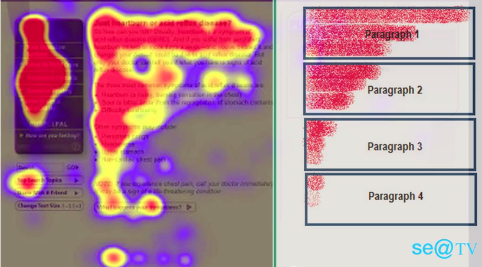
