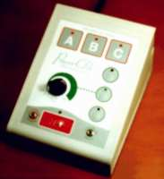
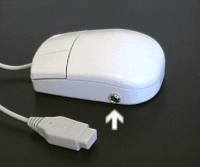
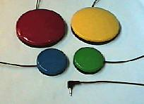
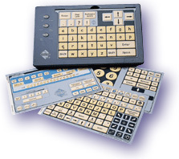
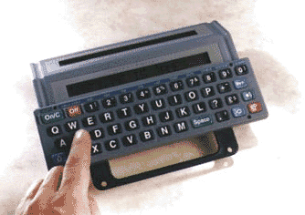
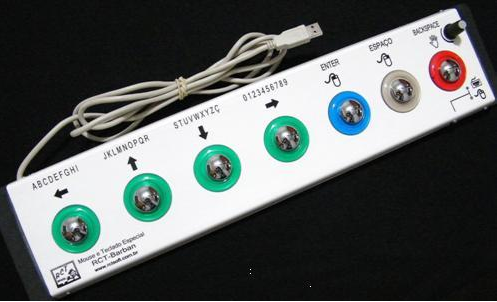
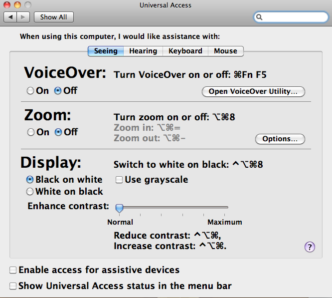

# Perfil do Usuário e Tecnologia Assistiva

Conforme vimos anteriormente, a Usabilidade sempre busca um grande número de pessoas, independente das habilidades que elas possuem.

Mas nem sempre um design teoricamente acessível significa que seja fácil de usar por todo tipo de usuário, que seja simples de aprender ou que tenha eficiente suporte ao usuário.

Diversos fatores interferem na usabilidade de acordo com o contexto e o perfil do usuário.

Um dos fatores decisivos que interferem na usabilidade é a experiência do usuário com computadores. Usuários experientes em um amplo conjunto de aplicativos têm mais ideia de que características procurar e de como o computador normalmente trata várias situações.

Especificamente, usuários com experiência em programação, são os mais aptos a combinar comandos em aplicações simples, não só orientadas a programação. Exemplo: uso de recursos avançados de editores de texto.

Entretanto, um erro frequente dos designers é achar que todos os usuários são especialistas naquele assunto sobre o qual o design está sendo desenvolvido. Usuários com perfis diferentes podem ter expectativas completamente diferentes com relação a interfaces.

Usuários com pouca experiência terão que ter mais explicações sobre o que o sistema faz e sobre o que as diferentes opções significam. Muito cuidado deve ser tomado com temas complexos que utilizam termos técnicos específicos.

**Exemplo:** sistema de um banco que oferece escolha de serviços financeiros. Poucos sabem diferenciar uma ação ordinária de uma ação preferencial, no mercado de ações, por exemplo.

Existem muitas outras diferenças entre usuários, além da experiência que possuem com computadores.

São exemplos de diferenças com implicações diretas sobre idade, gênero, cultura, habilidades de raciocínio, estilos de aprendizagem, etc...

Parece impossível obter ótimos graus de usabilidade em todos os atributos (variações de idade, experiência, cultura, gênero, etc...)

Por isso, compromissos são inerentes ao processo de design.

Por exemplo, o desejo de evitar erros catastróficos pode levar a se ter uma interface menos eficiente de usar, no estilo das interfaces que a cada ação solicita ao usuário a confirmação e a reconfirmação antes da ação ser executada.

Pense em um sistema que controla o funcionamento de uma usina nuclear... ele simplesmente não pode ser mal utilizado mas se for simples demais, pode facilitar a ocorrência de problemas, se for complicado demais, pode dificultar a solução de problemas em situações de emergência.

É importante estabelecer os objetivos de usabilidade a serem atingidos, quais os atributos a serem priorizados... isso é definido pelo contexto específico ao qual o projeto é dirigido.

## Tecnologia Assistiva

No Brasil, o Comitê de Ajudas Técnicas propõe o seguinte conceito para a tecnologia assistiva:

“Tecnologia Assistiva é uma área do conhecimento, de característica interdisciplinar, que engloba produtos, recursos, metodologias, estratégias, práticas e serviços que objetivam promover a funcionalidade, relacionada à atividade e participação de pessoas com deficiência, incapacidades ou mobilidade reduzida, visando sua autonomia, independência, qualidade de vida e inclusão social” (ATA VII - Comitê de Ajudas Técnicas (CAT) - Coordenadoria Nacional para Integração da Pessoa Portadora de Deficiência (CORDE) - Secretaria Especial dos Direitos Humanos - Presidência da República).

Usabilidade não é só um problema de tornar possível a realização de uma determinada tarefa.

É uma questão de tornar fácil e rápida essa tarefa.

Usabilidade, neste caso, reporta-nos à ideia de Acessibilidade.

Abaixo são apresentados produtos de tecnologia assistiva diretamente associados a questões de usabilidade e acessibilidade.

Interface para ligar/desligar eletrodomésticos.

Mouse que permite lugar um acionador (para programas de varredura).

Acionador para programas de varredura.

Teclado configurável Diversas lâminas com diferentes funções para as teclas.

Sintetizados de voz para ligar e escrever suas ideias no teclado: as palavras e frases serão lidas e executadas ao mesmo tempo.

Acessório que substitui todas as funções de um mouse convencional de computador. É destinado a usuários com dificuldades motoras, crianças e idosos. Mouse Especial RTC - Barban

Em um prédio bem projetado, a rampa de acesso vai diretamente da calçada para a porta de entrada e deixa o usuário próximo ao elevador. Qualquer pessoa (seja deficiente ou não) leva o mesmo tempo para se deslocar, digamos, até uma sala de reuniões no 7o. andar.

Se a rampa de acesso estiver atrás do prédio, um visitante de cadeira de rodas tem que contornar o prédio, entrar, e deslocar-se pelo saguão até encontrar o elevador. Embora a sala de reuniões do 7o. andar seja igualmente acessível, prédios mal projetados dificultam o acesso do cadeirante.

Obviamente, dependendo do tipo de limitação, alguns atributos de acessibilidade deverão ser enfatizados e outros desestimulados. Por exemplo:

Para pessoas com deficiência auditiva, recomenda-se:

- Uso da língua de sinais
- Mensagens em forma gráfica
- Textos pequenos e claros
- Animações e filmes

E evitar:

- Textos longos
- Ambiguidades na linguagem
- Som

Muitos sistemas operacionais de computadores possuem recursos internos de acessibilidade. Infelizmente não são muito conhecidos. Vejamos um deles, presentes em computadores da Apple:

### Em resumo, podemos considerar:

- O perfil do usuário e o contexto de uso são elementos decisivos no design de interfaces.
- Usabilidade é determinante para que pessoas com deficiência possam utilizar equipamentos eletrônicos. Essa área se denomina tecnologia assistiva e é um grande laboratório para questões de IHC.
- IHC tem o compromisso de facilitar o acesso a novas tecnologias por parte de todo tipo de pessoa.
