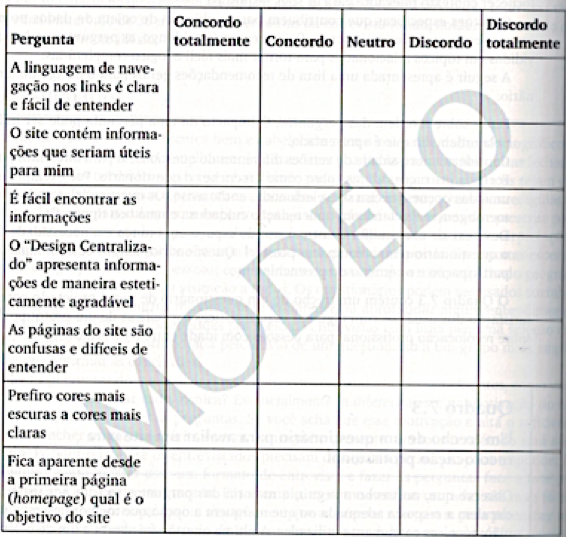
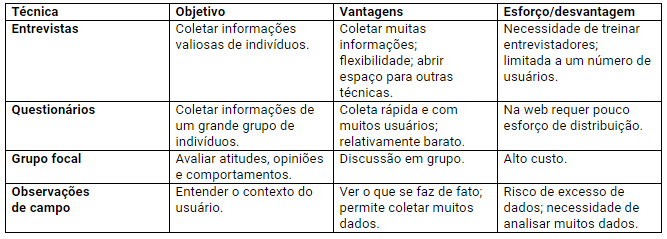

# Coleta de Dados

Vimos em discussões anteriores a importância do levantamento de requisitos para que se conheça as necessidades do cliente em relação ao design de um sistema de interação.

O objetivo da coleta de dados é obter dados suficientes, precisos e relevantes para um conjunto de requisitos estáveis. No âmbito da avaliação de interfaces, a coleta de dados é importante para captar as reações dos usuários e seu desempenho junto a um protótipo.

Várias técnicas são importantes e, dependendo da situação, algumas são mais fáceis e convenientes de serem empregadas: entrevistas, questionários, grupos focais, brainstorming, entre outras (em momento anterior estudamos design thinking).

Vamos destacar algumas delas, entendidas aqui como ferramentas necessárias ao desenvolvimento do projeto. Negligenciar requisitos implica desenvolvimento mais demorado, risco de desvios dos reais interesses do usuário e consequente fracasso do projeto.

Entrevistas, questionários e observação

As entrevistas envolvem um entrevistador conversando ao vivo com um ou mais entrevistados. As entrevistas podem ser presenciais ou não presenciais e as perguntas podem ser muito estruturadas (com respostas fechadas) ou não estruturadas (respostas abertas). Diferente de entrevistas, os questionários podem ser respondidos depois pelo usuário (processo assíncrono), podem ser em papel ou online.  A observação pode ser direta ou indireta. A observação direta envolve passar algum tempo observando a atividade enquanto ela acontece. Já  observação indireta consiste em registrar a atividade quando ela acontece, para ser estudado posteriormente.

Tanto as entrevistas, questionários e observação, podem coletar dados qualitativos ou quantitativos. Na prática, as técnicas podem ser combinadas, dependendo do projeto de design de interação.

Cinco questões centrais para coleta de dados

1) Estabelecimento de objetivos: quais os objetivos do processo de coleta de dados? Exemplos: dentre dos ícones, qual o mais adequado para representar o envio de uma mensagem de WhatsApp, ou ainda, o quão familiar é uma tecnologia para certo tipo de usuário.

1) Identificando os participantes: Quem são as pessoas que irão participar do processo?

3) Relacionamento com participantes: um aspecto importante é a relação entre as pessoas que fazem a coleta e as que fornecem os dados. Essa relação deve ser clara e profissional. Uma maneira de construir é que os participantes assinem um termo de consentimento. O fornecedor de dados deve ter a garantia de que os dados que ele está fornecendo não serão prejudiciais para ele.

4) Triangulação: o ideal seria que dados fossem extraídos de formas diferentes, em momentos diferentes, por pesquisadores diferentes, seguindo diferentes metodologias.

5) Estudos piloto: é uma execução experimental da pesquisa, antes de levá-la a um grupo maior.  Problemas potenciais  podem ser identificados com antecedência e corrigidos a tempo. Imagine distribuir 500 questionários e, em seguida, ser informado que duas perguntas estão confusas, isso desperdiça tempo e é um erro caro de corrigir. Isso pode ser evitado com um estudo piloto. 

## Entrevistas

Existem muitas possibilidades para entrevistas. Preece (2013) dá um bom exemplo de como podem ser entrevistas em projetos de design interativos:

A abordagem mais adequada para entrevistar depende da finalidade da entrevista, das perguntas a serem feitas e do estágio do ciclo de vida. Por exemplo, se o objetivo é obter as primeiras impressões sobre como os usuários reagem a uma nova ideia de design, como, por exemplo, um sinal interativo, então uma entrevista informal e aberta é a melhor abordagem. Mas se o objetivo é obter feedback sobre uma característica específica do design, como layout de um novo navegador, então uma entrevista estruturada ou questionário geralmente é melhor. Isso porque, neste caso, os objetivos e as perguntas são mais específicos.

## Entrevistas não estruturadas

Perguntas são exploratórias, mais parecidas com conversas. Não há restrições sobre o conteúdo das respostas. Por exemplo: “quais são as vantagens de usar telas sensíveis ao toque?”

## Entrevistas estruturadas

Perguntas curtas e claras, com respostas fechadas (leque de respostas possíveis é determinado).

Exemplos:

- Quantas vezes você visita este site? Todos os dias, uma vez por semana, uma vez por mês, menos de uma vez por mês?
- Algumas vezes você já fez compras online? sim/não? Se sua resposta foi sim, com que frequência você faz compras online: todos os dias, uma vez por semana, uma vez por mês; menos de uma vez por mês ?

## Entrevistas semiestruturadas

Combinam entrevistas estruturadas com não estruturadas, cabem perguntas abertas e fechadas

## Questionários

Questionários compõem entrevistas e podem ser enviadas em papel, email ou online. 

Exemplo de um questionário voltado para esclarecimento de requisitos em um projeto de design interativo

## Observação direta em campo

A observação em campo ajuda a preencher detalhes que não são obtidos por outras formas de investigação. Necessita ser planejada e executada com cuidado porque pode resultar em uma grande quantidade de dados, inclusive desnecessários.

A observação direta sugere insights sobre o contexto de uso (que objetos existem às mesas, humor do grupo de indivíduos, o que as pessoas estão fazendo e porquê, etc.)

## Grupos focais

Basicamente, grupos focais são entrevistas com grupos de pessoas. É bastante comum na área de marketing e campanhas políticas. Normalmente tem de três a dez pessoas e é mediada por um facilitador especialmente treinado. Os participantes são selecionados para fornecer uma amostra representativa da população alvo. O benefício de um grupo focal é que ele permite que questões diferentes e sensíveis sejam levantadas. Esta abordagem é mais indicada para investigar questões da comunidade do que aspectos individuais.

No caso de design de sistemas interativos, pode-se fornecer protótipos do produto e definir um foco para que tenham o que realizar e relatarem suas experiências. A conversa geralmente é gravada para análise posterior e os participantes convidados a esclarecer algum ponto em data posterior.

Técnicas de coleta de dados – Quadro comparativo (adaptado de Barbosa (2010))

