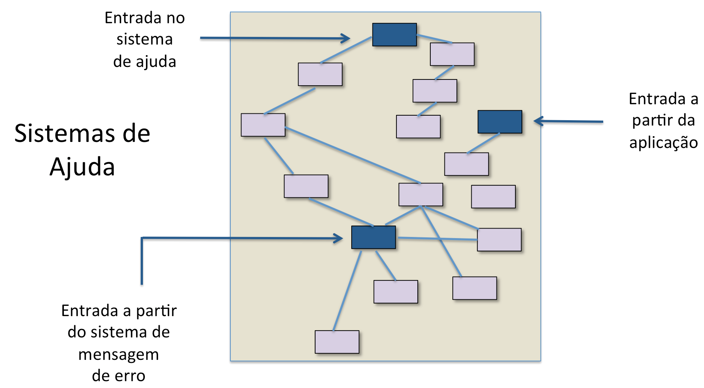
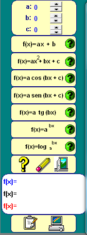
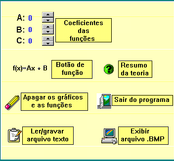
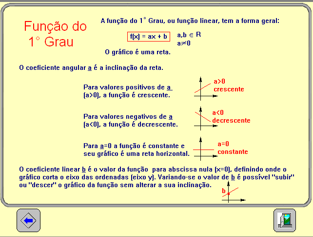
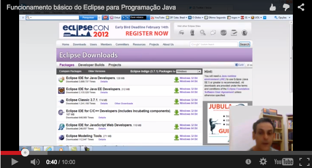
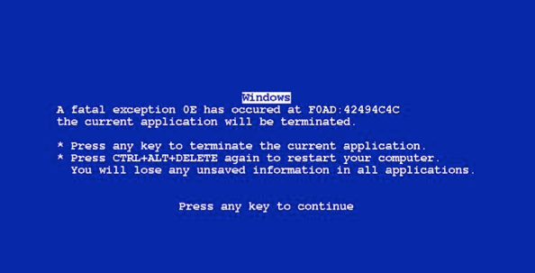

# Sistemas de Ajuda

## Introdução

É boa prática projetar para o erro, isto é, assumir que qualquer erro potencial de interação será cometido pelo usuário, a qualquer momento.

Uma vez cometido o erro, o sistema deve ajudar o usuário a se recuperar do erro, informando ao usuário sobre o que aconteceu, as consequências do fato e como reverter os resultados.

Evidentemente, o designer deve fazer o possível para que os erros nunca ocorram. Mas se o erro for cometido, o sistema deve ser capaz de detectá-lo e oferecer mecanismos simples para tratá-lo.

Além de erros, os sistema deve apoiar os usuários no sentido de esclarecer dúvidas durante a interação. Nesta aula tratamos de suporte ao usuário em relação a tutoriais, sistemas de ajuda e mensagens de erro.

## Sistemas de Ajuda

Sistemas de ajuda são componentes importantes de qualquer interface ou sistema interativo.

Eles incluem manuais, tutoriais, mensagens de erro, etc...

Infelizmente, a existência de sistemas de ajuda acrescenta mais complexidade à interface e, na maioria das vezes, não apoia tanto o usuário quanto se poderia esperar.

Em qualquer situação, um sistema de ajuda não pode ser usado como desculpa para um design ruim.

**O melhor cenário possível para que o usuário opere o sistema sem ter que usar um sistema de ajuda: o designer deve ter isso como um requisito básico.**

Reconhecer  diferença entre um bom e um mau sistema de ajuda é necessário para produzir um sistema bem-sucedido no tempo e orçamento estimados.

A produção do sistema de ajuda é, em si mesmo, um projeto que pode ser gerenciado em separado.

A própria produção do sistema de ajuda pode estimular a equipe de desenvolvedores a trabalhar mais a interface do sistema.

Além disso, a elaboração do sistema de ajuda é também uma forma de testar e validar o próprio sistema.

Sistemas de ajuda são apresentados em muitas formas. Variam desde apostilas impressas até ambientes sofisticados em que o comportamento do usuário é monitorado e o sistema se adapta a esse comportamento.

Vale a pena pensar nas diferenças de formato e suas implicações.

### Vantagens do sistema de ajuda em formato digital

Portabilidade, informação pode ser atualizada, busca é mais rápida, autores podem usar sons, cores e animações úteis em explicações complexas.

### Desvantagens do sistema de ajuda em formato digital

A tela do computador presenta menos informação do que o papel, a tela pode ser confusa para novatos, o uso do sistema de ajuda limita o espaço da área de trabalho na tela, o que força a memória de curto prazo do usuário.

Um bom sistema de ajuda necessita de uma linguagem adequada, compreensível pelo usuário mas ao mesmo tempo curta, informativa e clara.

Vamos ver alguns exemplos:

**Linguagem Pobre:** "O sistema descobrirá a solução quando a tecla F1 for pressionada."

- **Ficaria melhor:** "Você pode obter a solução pressionando F1."
- **Melhor ainda:** "Para resolver, pressione F1."

**Linguagem Pobre:** Evite termos como os verbos saber, pensar, compreender, ter memória...

- **Ficaria melhor:** "processar, imprimir, computar, ordenar, procurar..."
- **Melhor ainda:** "Para resolver, pressione F1."

## Estruturas de Sistemas de Ajuda

Vamos observar algumas estruturas de sistemas de ajuda de um software bastante conhecido. O usuário inicia selecionando se quer o sistema de ajuda do Power Point(Power Point Help) ou se prefere ver um tutorial geral sobre a ferramenta ou ainda outras opções. Veja a figura abaixo.

O usuário escolhe PowerPoint Help e aparece a tela da direita onde ele pode uma palavra relacionada ao assunto que precisa esclarecer.

Uma estrutura genérica de **sistemas de ajuda** é apresentada na figura a seguir. Note que o usuário tem diferentes entradas possíveis para acessar o sistema de ajuda.

Quanto mais você prestar atenção a diferentes sistemas de ajuda, maior será a sua capacidade de criar sistemas diferenciados.

As telas abaixo apresentam um sistema de ajuda bastante simples, compatível com as limitações do próprio sistema. A simplicidade de operação geralmente é uma virtude do sistema e a simplicidade de sistema de ajuda vai na mesma direção.

Software Gráficos RCT, sistema para plotar funções matemáticas simples.

O sistema de ajuda apenas ecoa informações quando o usuário clica o botão com o sinal de interrogação verde.

e quando clica o botão com sinal de interrogação amarelo.

Quanto mais sofisticado o sistema, mais sofisticado tende a ser também seu sistema de ajuda.

Sistemas de busca de informações e plotagem de gráficos WolframAlpha. Note na figura como a própria interface de entrada já sugere alguns caminhos de busca.

Na figura aparecem exemplos já prevendo a insegurança do usuário ao utilizar uma interface da linha de comando.

Um teste de fogo para um sistema tutorial são os sistemas de suporte como antivírus, por exemplo. O sistema tem que fornecer informações sempre atualizadas sobre o status do sistema do usuário, estar preparado para lidar com situações inesperadas para que cumpra a sua missão de proteger o computador. A interface é extremamente simples com o mínimo de botões.

## Mensagens de erro e sistemas de tutoriais

### Sistemas tutoriais

Tutoriais são parte do sistema de ajuda mas não são obrigatórios.

A ideia é que o usuário aprenda a operar o sistema sem precisar pagar um curso ou depender de um professor, mas em lugar disso, que possa aprender de forma autônoma.

Tutoriais podem ser produzidos em vídeo, onde as ações na tela podem ser gravadas.

Atualmente são muito comuns os tutoriais em vídeo em que a tela do sistema é apresentada e o uso do próprio sistema é narrado por um instrutor. A figura abaixo apresenta uma tela de um tutorial feito por um professor para explicar a utilização Eclipse para programação na linguagem Java.

### Mensagens de erro

Mensagens de erro devem retornar ao usuário informações sobre as ações que foram feitas e quais os resultados obtidos, é um conceito forte da teoria da informação e controle.

A ideia de mensagens de erro tem relação com feedback que o sistema deve fornecer ao usuário.

Imagine falar com uma pessoa sem ouvir sua própria voz (a famosa ausência de retorno que os músicos tanto reclamam nos palcos), ou desenhar com um lápis que não risca, ou enviar um documento para impressora, sem nenhum feedback.

A primeira impressão que os usuários podem ter de um sistema interativo depende das mensagens de erro do sistema.

Usuários inexperientes podem começar o trabalho e cometer um erro inicial e poderão corrigir imediatamente se a mensagem de erro for eficiente. Por outro lado, podem desistir completamente de continuar a utilizar o sistema se a mensagem não for apropriada.

Assim, projetos equivocados de mensagens de erro podem levar o usuário a rejeitar o sistema em vez de aceitá-lo.

Mensagens devem ser polidas, curtas, consistentes e construtivas.

A formação e a experiência anterior do usuário devem ser fatores determinantes no projeto de mensagens de erro.

A mensagem deve oferecer meios construtivos para que se possa recuperar o erro, não deve julgar o usuário.

A célebre tela azul do Windows ficou famosa por representar que o sistema repentinamente travou e não se tinha a menor ideia do que fazer em seguida, aliás, tinha sim que religar o computador para restaurar o sistema, mas isso não estava escrito.

Tela azul do Windows. Mensagem de erro que arrepiava os usuários.

Outro exemplo de mensagem de erro pouco esclarecedora é mais recente e conhecida. É aquela que aparece quando o endereço da Internet não pôde ser localizado.

Outros exemplos de mensagens de erro são presentados na figura a seguir.

### Roteiro para elaborar boas mensagens de erro

Mensagens devem ser curtas e orientadoras sobre como o usuário deve resolver o problema.

- Evite termos como FATAL, ERRO, INVÁLIDO, MAU, ILEGAL...
- Evite códigos numéricos e letras maiúsculas.
- Use mensagens sonoras apenas se estiverem sob o controle do usuário.
- Mensagens deveriam estar associados a sistemas de ajuda.
- Mensagens deveriam ter uma variedade de níveis.
- Mensagens curtas acompanhadas de explicações detalhadas.
- Sistemas de ajuda são parte importante do sistema como um todo, mas geralmente não cumprem a função de apoiar o usuário.
- A percepção do usuário em relação ao sistema tem muito a ver com mensagens de erro.
- Mensagens de erro deveriam servir para orientar o usuário e não para condená-lo.
