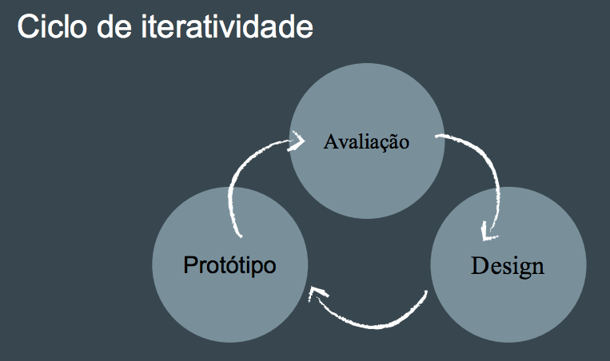

# Gamificação

O ambiente de desenvolvimento de jogos e de gamificação se compara a um laboratório de desenvolvimento de interfaces de sistemas interativos. Muitos avanços que aparecem no ambiente de games são depois incorporados à indústria como um todo. Vamos conhecer alguns aspectos dos processos de desenvolvimento de games e gamificação.

## O que é Gamificação?

O termo gamificação surgiu em 2003, quando um gamer designer inglês - Nick Pelling - estabeleceu uma consultoria para criar interfaces, semelhantes às dos jogos, para aparelhos eletrônicos. O termo só se popularizou a partir de 2010 e vem sendo utilizado cada vez mais...

> Gamificação é o uso de elementos do jogo e técnicas de game design em um contexto que não é o do jogo em si.

## Elementos do jogo

O jogo se apresenta como uma experiência integrada, mas é constituído de pequenos pedaços.

O jogo possui elementos que possibilitam o aprendizado durante a própria experiência, garantindo feedback em tempo real, mantendo a motivação do jogador.

O jogo possui um objetivo bem delineado - a interface gamificada também deve ter esta clareza. Este objetivo pode ser atingido por meio do uso de uma metodologia que estabeleça o sistema gamificado como um plano de ação.

Um sistema gamificado não é um jogo! No lugar de explorar um mundo de fantasia ou matar monstros ficcionais, o objetivo principal do sistema gamificado é garantir uma conexão mais engada entre o usuário e o conteúdo.

## A gamificação pode ser Interna ou Externa

### Interna

Alterando a estrutura da empresa, incentivando a produtividade e a colaboração. O público da gamificação interna já faz parte de uma comunidade. Porém, a dinâmica de motivação deve estar de acordo com a instituição, seu sistema de recompensas e a filosofia da empresa.

### Externa

Quando envolve o engajamento de um maior número de pessoas, externas à instituição. Pode ser voltada a um público mais amplo e variado, com acesso em múltiplas plataformas: mobile, PC, etc...

## Comportamento do usuário

> "É possível alterar o comportamento do usuário?"

A gamificação também pode ser utilizada para a adoção de novos hábitos comportamentais. Nesse caso o sistema gamificado deve contribuir para auxiliar na adoção de hábitos benéficos.

Vale lembrar que o Engajamento é a chave de um sistema gamificado!

Ele possibilita tanto o uso do peering quanto o do crowdsourcing para a solução de problemas que exigem uma inteligência complexa e coletiva.

## Game Thinking

> "Pensando como um game designer"

### O que é?

Um sistema gemificado não é um jogo. Ele se apropria dos elementos existentes nos jogos para engajar os envolvidos.

### Quem?

Mesmo sem ser um game designer você pode propor um sistema gamificado a partir do seu repertório enquanto jogador e dos seus conhecimentos do conteúdo.

### Quando?

Nem sempre o sistema gamificado é a solução. Ele não vai mascarar problemas estruturais da instituição. Pode até mesmo piorar a situação, caso sua implementação seja forçada e as necessidades dos usuários sejam ignoradas.

## Planejamento: Como começar a desenvolver?

### Gamificação envolve:

- Motivação. Como incentivar um comportamento?
- Escolhas significativas e atividades propostas para o seu público são suficientemente interessantes?
- Estrutura. Como os comportamentos desejados podem ser modelados pelo sistema?
- Conflitos em potencial. Como evitar conflitos com estruturas motivadoras já existentes?

### Motivação: Intrínseca e Extrínseca

Gamificação é uma forma de design motivacional. É fundamentalmente um meio de fazer com que as pessoas se interessem em assumir um determinado comportamento. No sistema, a motivação pode ser intrínseca ou extrínseca.

- Motivação Intrínseca é aquela que surge do desejo do próprio indivíduo, de sua necessidade de realização, sendo portanto duradoura se comparada à motivação extrínseca.

- Motivação extrínseca, por sua vez, é aquela gerada por fatores externos, como bonificações em forma de dinheiro ou mesmo ameaças (pois a motivação também pode ser negativa).

### Escolhas: o que são escolhas significativas?

Se o usuário percebe que está seguindo um caminho pré-determinado, repetitivo, seu engajamento com o sistema será prejudicado.

- Para se sentir realizado, o usuário precisa sentir que seu direito de escolha é respeitado.

### Estrutura: Plataforma e Resultados

A Gamificação pode ser digital ou aplicada de maneira analógica.

O importante aqui é levar em consideração como o responsável pelo sistema fará o acompanhamento dos dados que envolvem a experiência proposta.

- Mensurar os resultados e acompanhar as métricas pode ser mais fácil a partir de um sistema digital, o que deve ser levado em consideração no projeto.

### Conflitos: Problemas em potencial

> "O sistema proposto pode conflitar com outros meios de motivação?"

- Um sistema como o Fitocracy (que trabalha a motivação intrínseca), por exemplo, não precisa oferecer um prêmio em dinheiro para os usuários que percam mais peso.

### Recursos: Ferramentas e Metodologias

Na maior parte dos exemplos de gamificação, está presente a tríade PBL:

- Points - Um sistema de pontuação, que deve ter validade para algum tipo de interação.

- Badges - Medalhas, condecorações, achievements, que o usuário recebe por realizar alguma atividade específica.

- Leaderboard - uma lista dos usuários mais participativos.

## Seis passos para a gamificação

- Definir os objetivos do seu sistema
- Delinear o comportamento desejado
- Descrever seus jogadores
- Imagine seus ciclos de atividade
- Não esqueça a diversão
- Ofereça as ferramentas adequadas

> "Metodologia de desenvolvimento deve ser Iterativa: Trabalhando por ciclos"

