# Ferramentas de Prototipação

As ferramentas de prototipação são valiosas aliadas quando já se sabe que caminho seguir no processo de desenvolvimento de um sistema interativo, mas servem também para estabelecer diálogos melhores com clientes sobre o que eles desejam que o sistema apresente em termos de requisitos e funcionalidades. Tendo os requisitos bem estabelecidos ou não, as ferramentas de prototipação potencializam ideias em diferentes estágios de desenvolvimento do sistema.

Existem inúmeras ferramentas de prototipação.

Duas ferramentas são muito importantes e particularmente interessantes em projetos de desenvolvimento de interfaces, o Balsamiq e o Figma.

O Balsamiq enquadra-se na categoria de wireframes ou esboços de grade. Esta etapa ainda pode ser feita por alguém sem muita experiência em design, é uma forma de organizar as ideias rabiscadas anteriormente no papel.

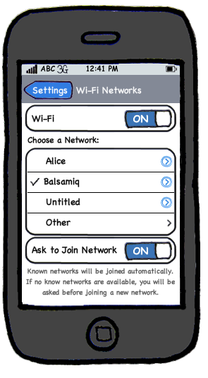

O mérito do Balsamiq é a simplicidade. Protótipos de baixa fidelidade são facilmente construídos usando-se o Balsamiq. É possível simular completamente a navegação, a disposição de botões, telas, sequências, enfim o design do projeto antes de partir para a programação em si.

Entre algumas das principais características desta interessante ferramenta, estão:

- reproduzir a facilidade da experiência de rascunhar no papel ou quadro, mas usando o computador
- estimular o foco na estrutura e no conteúdo, evitando longas discussões sobre cores e outros detalhes que deveriam vir depois no processo.
- gerar mais ideias e estimular a descoberta de novas soluções.

Observe nas imagens abaixo o protótipo do lado esquerdo e o resultado final depois do desenvolvimento do aplicativo Balsamiq.

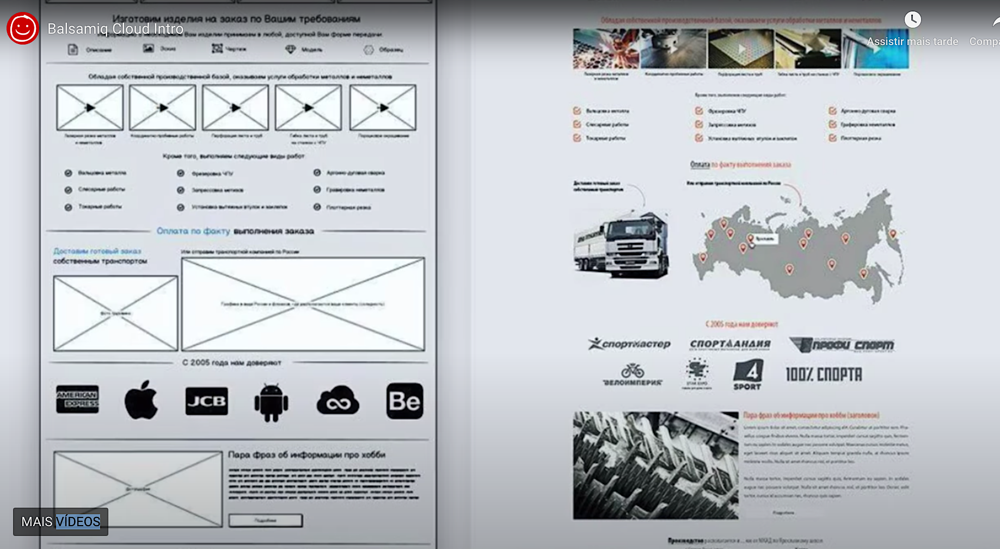

Note que todos os elementos previstos no protótipo de baixa fidelidade aparecem depois na tela final do aplicativo. O Balsamiq é um grande facilitador no processo de design de interfaces porque reproduz a facilidade com que rabiscamos em papel.

Quando se abre o Balsamiq, você começa logo a trabalhar no protótipo da interface.

Do lado esquerdo da tela aparece a identificação da tela como se você estivesse trabalhando em um slide. Depois mais telas podem ser acrescentadas dentro de um mesmo projeto.

Uma série de opções de recursos aparecem no alto da tela, desde formato da tela, botões, formulários, recursos de imagem e som, etc. Para cada elemento acrescentado, aparecem controles do lado direito para ajustes finos. Se você selecionar uma plataforma específica o menu inferior indicará os controles daquela própria plataforma, mas outros controles podem ser acrescentados.

Por exemplo, na tela abaixo selecionou-se a opção I-Pad, uma serie de controles típicos do I-Pad aparecem, mas outros controles de outros sistemas também podem ser combinados.

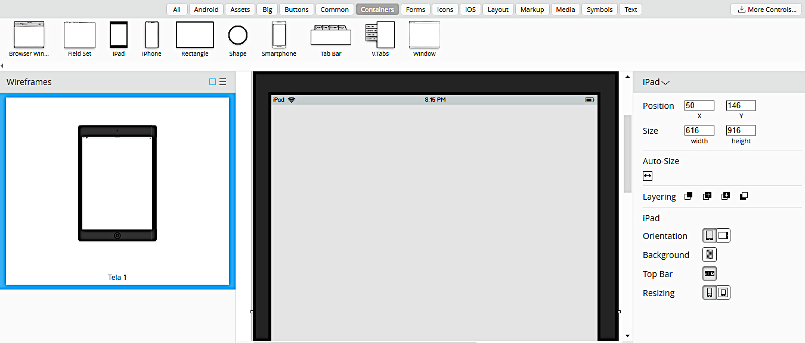

Com foco na parte superior da tela, aparece uma fileira de guias e opções.

Observe o que acontece ao se clicar na guia Android: aparecem os controles típicos deste sistema:

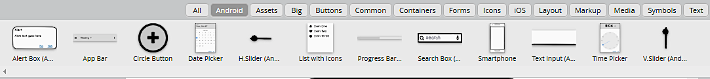

Na guia Buttons (Botões) aparecem as seguintes opções:

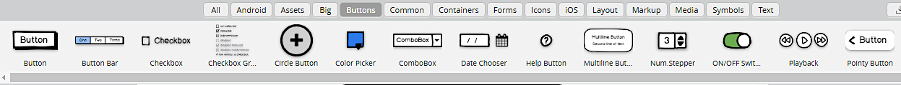

Na guia Form (Formulários) aparecem as seguintes opções:

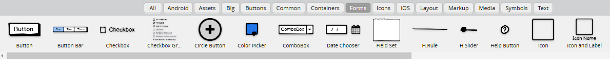

Na guia Icons (Ícones) aparecem as seguintes opções:

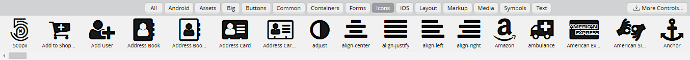

Na guia iOS aparecem as seguintes opções:

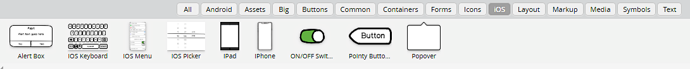

Na guia Layout aparecem as seguintes opções:

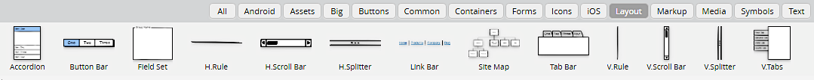

Na guia Media aparecem as seguintes opções:

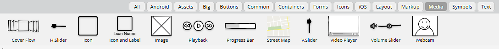

Na guia Text (Texto) aparecem as seguintes opções:

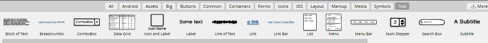

Além desses controles, a ferramenta oferece vasto leque de modelos prontos de sistemas bem conhecidos:

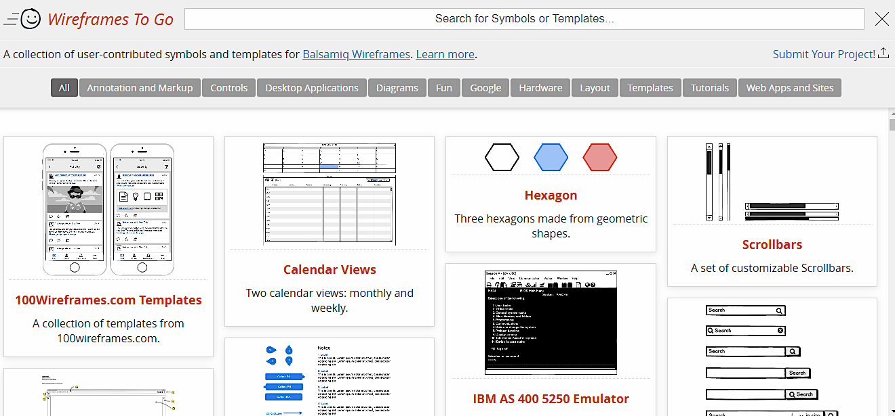

Note que sempre é possível acrescentar novas telas (alto da tela à esquerda) para ir compondo todas as telas do sistema. A criação de um bom protótipo por meio do Balsamiq concentra atenção ao que é importante desde o início em um projeto de sistema interativo: funcionalidades, navegação, entradas e saídas de informação.

II - Ferramenta FIGMA

Apresentamos abaixo algumas funcionalidades da ferramenta Figma. É uma ferramenta com recursos avançados de design capaz de fazer uma excelente aproximação com a real interface que terá o sistema. 

Um ponto de destaque de ferramentas como o Figma é que ele possibilita a simulação de navegação e algumas aproximações maiores com um layout mais bem definido. Para quem entende ou está mais seguro em termos de design, pode-se usar direto o Figma, sem passar por ferramentas do tipo wireframe como o Balsamiq. Outras vantagens desta ferramenta é que ela permite a inserção de comentários em diferentes tipos de desenho e protótipos, o que pode facilitar muito a comunicação com o cliente e com a equipe de desenvolvimento. Aliás, a grande força do Figma é exatamente o trabalho colaborativo – projetos podem ser desenvolvidos em conjunto por pessoas ao mesmo tempo. Além disso, permite criar bibliotecas de componentes reutilizáveis a toda a equipe em diferentes projetos.

Veja abaixo um conjunto de três telas que apresentam a simulação de navegação pelo FIGMA.

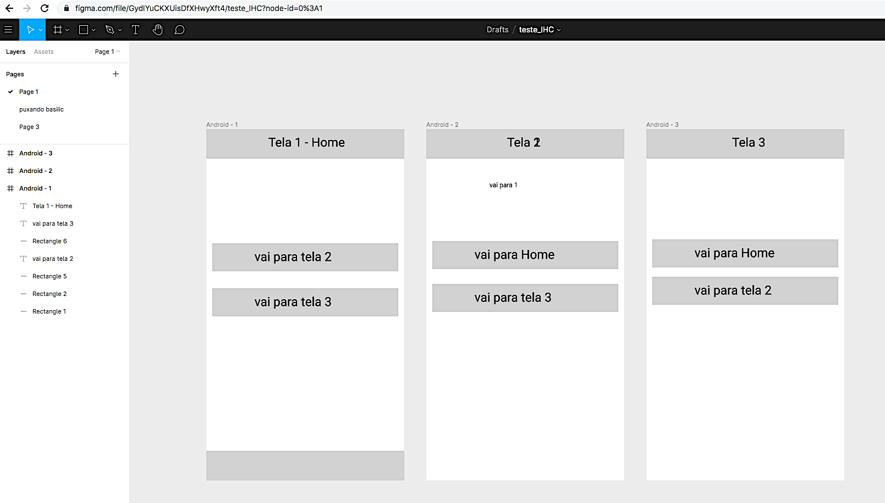

Ao executar a simulação, temos a sensação real de usar o sistema. Veja nas telas abaixo:

Tela inicial do sistema, simulando a navegação pelo aplicativo. Ao clicar no botão de baixo…

…vai para a tela 3. Ao se clicar no botão de cima…

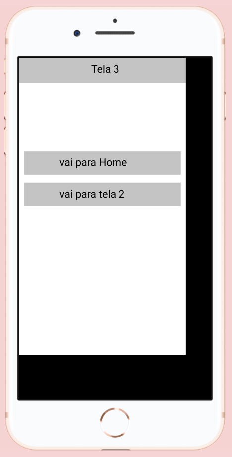

…retorna-se à tela inicial.

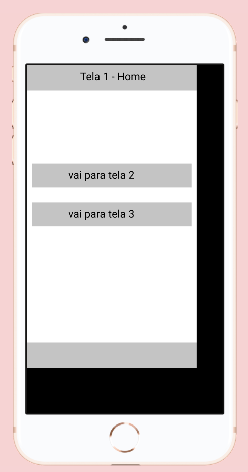

O Figma permite o ajuste fino do layout de acordo com os sistemas mais comuns do mercado, inclusive de celulares de diversas marcas.

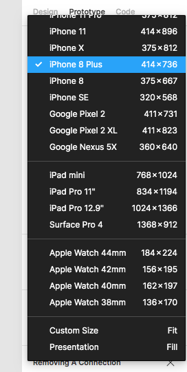

A experiência de se cadastrar e usar uma ferramenta como Balsamiq ou Figma ainda que por um tempo limitado é muito importante  para o desenvolvimento de projetos de interface de sistemas interativos.

Evidentemente existem muitas outras ferramentas, muitas delas aplicáveis a uma tecnologia ou produto específico. A ideia aqui foi apresentar apenas dois exemplos de ferramentas: uma simples, próxima do uso de lápis e papel para se fazer esboços interessantes e outra que demanda conhecimentos mais avançados de design e voltada para o trabalho colaborativo. Conforme vimos em momentos anteriores, o desenvolvimento tem vários caminhos e metodologias. A ferramenta mais adequada dependerá dos recursos disponíveis e do grau de interação e comunicação com o cliente e entre os membros da equipe.
